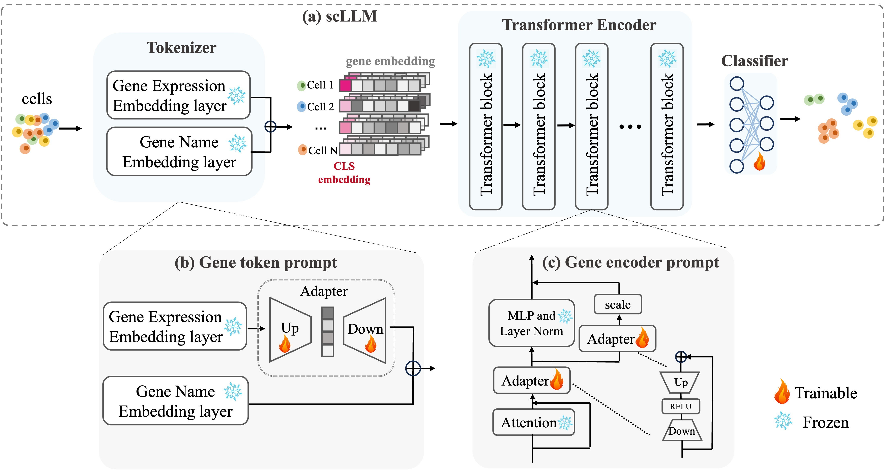

# scPEFT
This is the official repository for scPEFT: Parameter-Efficient Fine-Tuning Enhances Adaptation of Single Cell Large Language Model for Cell Type Identification

## A Quick Overview


## Requirements
Download model checkpoint: [scGPT_human](https://drive.google.com/drive/folders/1oWh_-ZRdhtoGQ2Fw24HP41FgLoomVo-y) and put it at ./scGPT_human

1. Clone the repository:
    ```shell
    git clone https://github.com/laolintou/scPEFT.git
    ```

2. Navigate to the project directory and create a conda environment:
    ```shell
    cd scPEFT
    conda env create -f environment.yaml
    ```

3. Activate the conda environment:
    ```shell
    conda activate scGPT
    ```

## Data preparation
All data used in this study are publicly available.

| Dataset                                        | Link                                                                                   |
|------------------------------------------------|-----------------------------------------------------------------------------------------------|
| MS                                             | [M.S.](https://github.com/bowang-lab/scGPT/tree/main/data/)                                   |
| Zheng68k                                       | [Zheng68k](https://support.10xgenomics.com/single-cell-gene-expression/datasets(SRP073767))  |
| NSCLC                                          | [NSCLC](https://www.ncbi.nlm.nih.gov/geo/query/acc.cgi?acc=GSE179994)                           |
| COVID-19                                       | [COVID-19](https://figshare.com/articles/dataset/seu_obj_h5ad/16922467/1)                      |


## Get Started
Firstly，enter folder tutorials  ```cd scPEFT-main/tutorials```

### native 
```
python Tutorial_Reference_Mapping.py --data_name "ms"
```
### full finetune
#### train & test
```
python full_finetune.py --data_name "ms" --prompt_type "finetune" --use_prompt False
```
### finetune classifier
#### train & test
```
python finetune_classifier.py --data_name "ms" --use_prompt False
```
### Gene token prompt
#### train & test
```
python gene_token_prompt.py --data_name "ms" --prompt_type "Gene_token_prompt" --use_prompt True
```
### Gene encoder prompt
#### train & test
```
python gene_encoder_prompt.py --data_name "ms" --prompt_type "Gene_encoder_prompt" --use_prompt True
```
### prefix prompt
#### train & test
```
python prefix_prompt.py --data_name "ms" --prompt_type "prefix_prompt" --use_prompt True
```
### LoRA prompt
#### train & test
```
python lora.py --data_name "ms" --prompt_type "LoRA" --use_prompt True
```
## Command Line Arguments
data_name ：dataset name

prompt_type：the type that you add into model

use_prompt：whether use prompt or not

## Result Output Format
```
Weighted Accuracy: XXX, Weighted Precision: XXX, Weighted Recall: XXX, Weighted F1: XXX
-------------------------------------------------------------
                accuracy   precision    recall    f1-score    support
XX cell type         -         -          -          -           -
...
...

              accuracy                               -           -
             macro avg         -          -          -           -
          weighted avg         -          -          -           -
```
Weighted Accuracy: The balanced accuracy in binary and multiclass classification problems to
    deal with imbalanced datasets.

Weighted Precision: weighted Precision based on number of each cell type

Weighted Recall: weighted Recall based on number of each cell type

Weighted F1: weighted F1 score based on number of each cell type


## Built With

[pytorch](https://pytorch.org/)

[scGPT](https://github.com/bowang-lab/scGPT)
## Citation
